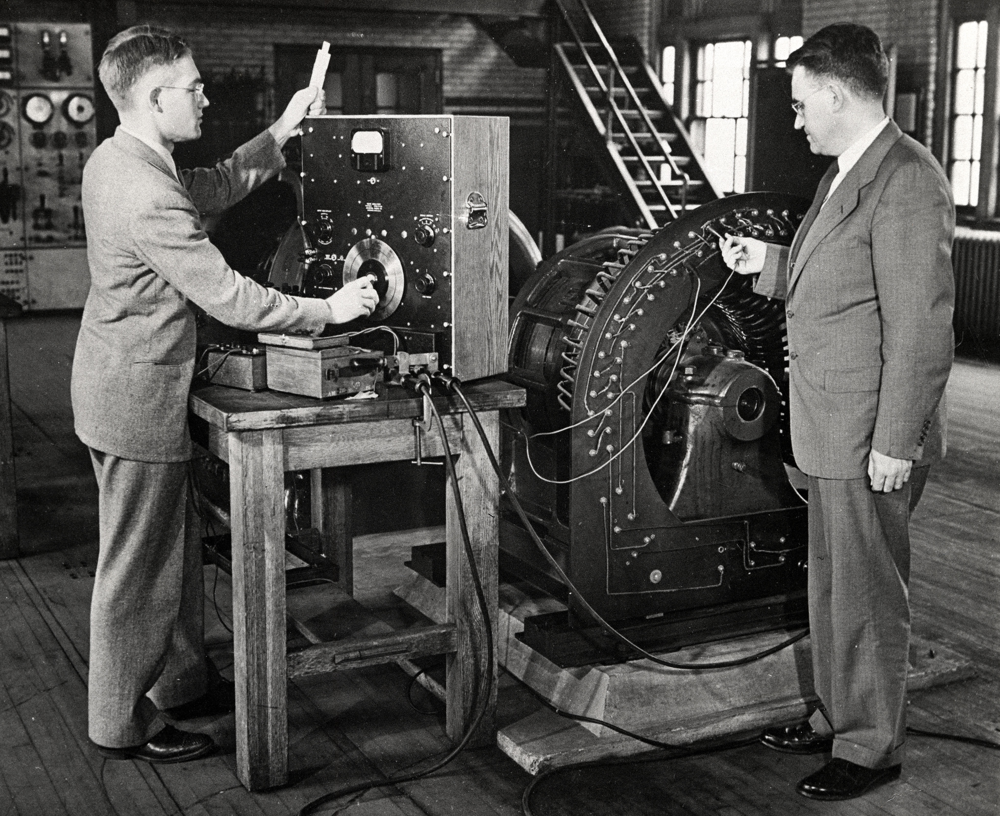

# Adding images to your page or post

#### Here are a few methods to add images to your webpage:
[View the source Markdown for this page](https://raw.githubusercontent.com/ubc-lib-geo/gis-workshop-waml-template/master/content/examples/images.md)


___

**Add an image from the web:**

Start an in-line link with an exclamation point then place the alt text in the brackets followed by the image link in the parentheses. Alt text (or alternative text) is important to include with any image to ensure that people using screen readers can fully experience the content on your webpage.

```

```


You can also add images "reference style." This is handy if you don't want to clutter up your Markdown or if you need to use an image more than once. You can just place the references at the bottom of the page. It goes like this:

```
![The Red Planet][Mars]

[Mars]: https://upload.wikimedia.org/wikipedia/commons/thumb/0/02/OSIRIS_Mars_true_color.jpg/1200px-OSIRIS_Mars_true_color.jpg
```

![The Red Planet][Mars]

___  

**Add an image from your directory:**

You can also add images from a file directory. If you're using GitHub Pages, that means you would want a folder where your content or images live in your GitHub repository. But note that internal links from a "post" can be a little tricky. See the [documentation](https://jekyllrb.com/docs/liquid/tags/#links).  

```

```


___

**Link an image:**

To link an image, you just need to embed the image syntax within the syntax for a hyperlink:

Here's a regular link:

```
[CMU site](https://www.cmu.edu/)
```

[CMU site](https://www.cmu.edu/)

Here's a linked image:

```
[](https://www.cmu.edu/)
```

[](https://www.cmu.edu/)

_Click Me!_


____

**Need to get extra fancy?**

You can also add html directly to Markdown. Say you wanted to change the size of an image, for example.


```

```


<!--reference links-->
[Mars]: https://upload.wikimedia.org/wikipedia/commons/thumb/0/02/OSIRIS_Mars_true_color.jpg/1200px-OSIRIS_Mars_true_color.jpg
